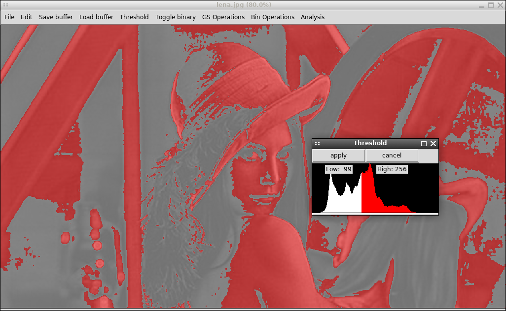
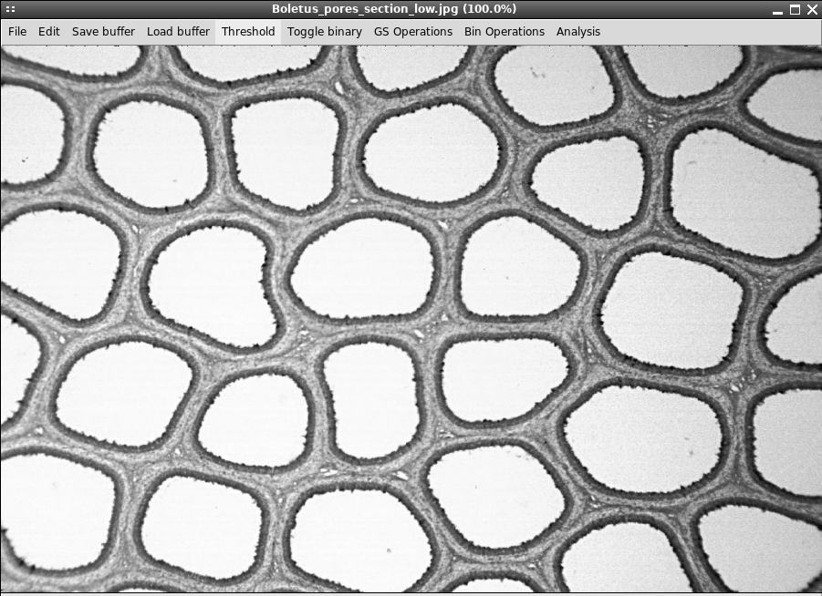

# imagemicro
Small tkinter gui tool for basic greyscale image processing using PIL and scipy



Implemented tools:
- Thresholding
- Binary masking
- Greyscale arithmetic
- PIL filters and Sobel from scipy.ndimage
- Watershed with grid/manual point selection
- LUT transforms
- FFT/IFFT
- Binary arithmetic (boolean operations)
- Binary feature selection/rejection
- Binary morphology operations
- Feature size sort to greyscale algorithm
- Elementary binary drawing operations
- Elementary binary feature analysis with pyplot

A file may be opened using the file dialog. This is placed in the primary greyscale buffer. Thresholding places the result of the thresholding operation in the primary binary buffer. This is superimposed on the primary greyscale buffer in red. The primary greyscale buffer may be saved into one of the greyscale slots for later use. Similarly, the primary binary buffer may be saved into one of the binary slots for later use. GS Operations hosts some greyscale operations. Bin Operations contains binary image operations. An experimental logger is included which prints the python code used to produce the actions performed in the gui by the user for prototyping.

Todo: Clean up the code, separate UI from function further. A macro functionality, to run user-provided python routines within the GUI is the end goal of the logger functionality. Morphological feature analysis is desirable.


Please note that this is a work in progress and primarily created as a learning exercise.



## Usage
The easiest way to use the program is through virtualenv. Make sure you have python (2.7) and virtualenv installed. Clone the repository and, in the repository folder, run the following commands.

```bash
virtualenv env
source ./env/bin/activate
pip2 install -r requirements.txt
```

Now, run `python2 main.py` to start the program.
